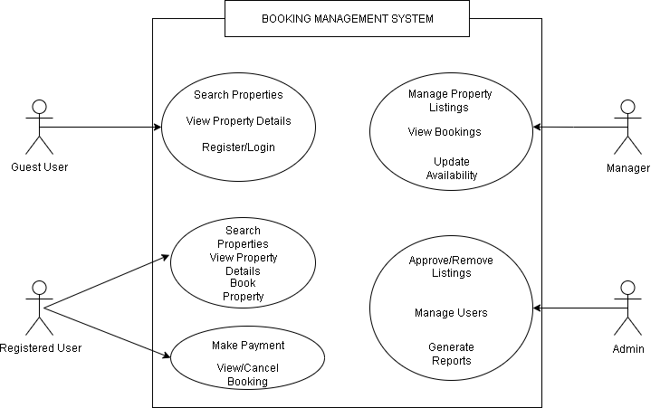

# Requirement Analysis

## Requirement Analysis in Software Development

🧩 **Purpose of the Repository — Requirement Analysis**

This repository focuses on the **Requirement Analysis** phase of the **Software Development Life Cycle (SDLC)**.  
Its purpose is to outline how software requirements are gathered, analyzed, and documented to ensure a clear understanding of user and business needs.  
It serves as a foundational blueprint for creating accurate and effective system designs that align with stakeholder expectations and project goals.

---

## What is Requirement Analysis?

### Requirement Analysis in Software Development

Requirement Analysis is a critical phase in the Software Development Life Cycle (SDLC) where the project team collaborates with stakeholders to gather, analyze, and define the requirements of the software system to be developed.  
This process ensures that everyone involved has a clear and mutual understanding of what the system should accomplish and how it should perform.

During this phase, the team identifies the **functional and non-functional requirements** of the system—what the software should do, the conditions it must operate under, and the constraints it must adhere to.  
The outcome of this stage is typically a **Software Requirements Specification (SRS)** document, which serves as a blueprint for design, development, and testing.  
It's important for building software that meets user expectations, stays within scope, and delivers value to the business. It lays the groundwork for all subsequent stages of the SDLC.

---

## Why is Requirement Analysis Important?

### Key reasons why Requirement Analysis is critical

#### Clarity and Understanding

Requirement Analysis helps the team fully understand the expectations and needs of the stakeholders, reducing ambiguity and ensuring that the project stays aligned with business objectives.

#### Scope Definition

It clearly defines the scope of the project—what is included and what is not—helping to prevent scope creep, which can lead to delays and cost overruns.

#### Basis for Design and Development

The requirements gathered serve as the foundation for the software’s design and development.  
A well-defined set of requirements ensures that the system is built correctly and efficiently.

#### Cost and Time Estimation

With clear and detailed requirements, project managers can make accurate estimates of cost, resources, and timelines, improving project planning and execution.

#### Quality Assurance

Requirement Analysis ensures that the final software product meets the specified requirements, leading to higher quality, better user satisfaction, and fewer post-deployment issues.

---

## Key Activities in Requirement Analysis

### ◦ Requirement Gathering 🗂️

This activity focuses on collecting information from stakeholders and end-users to understand what the system should achieve.

**Common techniques include:**

- **Interviews:** Conducting one-on-one or group interviews with stakeholders to gather detailed insights about their needs.
- **Surveys/Questionnaires:** Distributing surveys to collect information from a wider audience efficiently.
- **Workshops:** Organizing collaborative sessions to discuss requirements and align perspectives.
- **Observation:** Observing end-users in their actual work environment to understand real-world challenges and needs.
- **Document Analysis:** Reviewing existing documents, reports, and systems to identify current functionalities and gaps.

---

### ◦ Requirement Elicitation ✍️

This step focuses on extracting, clarifying, and refining stakeholder needs into clear requirements.

**Key methods include:**

- **Brainstorming:** Generating ideas and possible system features through group discussions.
- **Focus Groups:** Engaging selected stakeholders in discussions to gather detailed, targeted requirements.
- **Prototyping:** Building simple system prototypes to help stakeholders visualize concepts and refine requirements.

---

### ◦ Requirement Documentation 📚

Once gathered and clarified, requirements are formally documented to serve as a reference throughout the SDLC.

**Documentation types include:**

- **Requirement Specification Document:** A detailed record of all functional and non-functional requirements.
- **User Stories:** Short descriptions of desired functionalities from the user’s perspective.
- **Use Cases:** Visual or written representations showing how users interact with the system.

---

### ◦ Requirement Analysis and Modeling 📊

This activity involves evaluating, prioritizing, and visualizing requirements to ensure they are realistic and well-structured.

**Core tasks include:**

- **Requirement Prioritization:** Ranking requirements based on importance, urgency, and business value.
- **Feasibility Analysis:** Assessing whether requirements are achievable within technical, financial, and time constraints.
- **Modeling:** Creating visual models such as data flow diagrams (DFDs) or entity-relationship diagrams (ERDs) to represent system processes.

---

### ◦ Requirement Validation ✅

The final step ensures that documented requirements accurately reflect stakeholder needs and are ready for implementation.

**Validation activities include:**

- **Review and Approval:** Conducting stakeholder reviews to confirm the accuracy and completeness of requirements.
- **Acceptance Criteria:** Defining measurable standards to verify when a requirement is fulfilled.
- **Traceability:** Creating a traceability matrix to link each requirement to corresponding design, development, and testing activities.

---

## Types of Requirements

### Functional Requirements ⚙️

**Definition:**  
Functional requirements describe what the hotel booking system should do — the essential features and operations that enable users (customers and hotel managers) to perform their tasks efficiently.

**Examples:** Property search, user registration, hotel listing management, booking and payment processing, user authentication.

**Key Functional Requirements:**

- **Search Properties:**  
  Users should be able to search for hotels or rooms based on criteria such as location, price range, amenities, and availability.  
  _Example:_ A traveler searches for “2-star hotels in Accra with free Wi-Fi and breakfast.”

- **User Registration:**  
  New users (both customers and hotel managers) should be able to create accounts with personal and login details to access the system.

- **Property Listings:**  
  Hotel managers should be able to add, update, and manage hotel information including room types, prices, images, and descriptions.  
  _Example:_ A hotel manager uploads new room images and updates room rates during the festive season.

- **Booking System:**  
  Customers should be able to book available properties, view booking details, and manage or cancel their reservations.  
  _Example:_ A customer books a double room for three nights and receives instant confirmation.

- **User Authentication:**  
  The system should have a secure login and registration process to verify user identity and protect account access.

---

### Non-functional Requirements 🛡️

**Definition:**  
Non-functional requirements describe how the hotel booking system should perform, focusing on quality aspects like performance, scalability, and security rather than on specific functionalities.

**Examples:** Performance, security, scalability, usability, reliability.

**Key Non-functional Requirements:**

- **Performance:**  
  The system should load pages within 2 seconds and efficiently handle up to 10,000 concurrent users, especially during peak booking seasons.

- **Security:**  
  User data, including payment details, must be encrypted. Implement secure authentication and protect the system from threats like SQL injection, XSS, and data breaches.

- **Scalability:**  
  The system should be built on a microservices architecture to scale horizontally as traffic and data volume increase (e.g., adding more servers for high demand).

- **Usability:**  
  The application should have an intuitive and user-friendly interface, ensuring smooth navigation for both customers and hotel managers.  
  _Example:_ A simple booking flow that allows first-time users to complete a reservation in under three steps.

- **Reliability:**  
  The platform should maintain 99.9% uptime and include redundancy and recovery mechanisms to minimize downtime and data loss.

---

## Use Case Diagrams

### What are Use Case Diagrams?

Use Case Diagrams are visual representations of interactions between users and the system.  
They show how different users (actors) interact with the system to achieve specific goals (use cases).

**Benefits of Use Case Diagrams:**

- Provide a clear visual representation of system functionalities.
- Help in identifying and organizing system requirements.
- Facilitate communication among stakeholders and development team.

### Booking Management System – Use Case Diagram

It shows how various actors/users interact with the system to perform different operations.

**Actors**

- **Guest User:** Can Search Properties, View Property Details, Register / Login.
- **Registered User:** Can Book Properties, Make Payment, View / Cancel Booking.
- **Manager:** Manage Property Listings, View Bookings, Update Availability.
- **Admin:** Approve / Remove Listings, Manage Users and Generate Reports.

## Below is the Diagram

## 

---

## Acceptance Criteria

**Acceptance Criteria** are clearly defined conditions that determine whether a software feature or functionality has been successfully implemented.  
They outline the **expected behavior** of a feature and serve as a **benchmark for completion and approval** by stakeholders.

In essence, acceptance criteria translate **business requirements** into **measurable outcomes**, ensuring that the developed feature truly meets user needs and aligns with project objectives.

They act as a **shared understanding** between developers, testers, and stakeholders—guiding implementation, driving test cases, and confirming that the final product performs as intended before release.

### Importance of Acceptance Criteria in Requirement Analysis

Acceptance Criteria play a crucial role in **Requirement Analysis** by defining the exact conditions under which a requirement or feature is considered complete and satisfactory. They serve as a bridge between stakeholders and developers, ensuring mutual understanding of expectations and quality standards before implementation begins.

#### Key Importance:

1. **Clarity and Shared Understanding**  
   Acceptance Criteria provide a clear, measurable definition of what success looks like for each requirement.  
   This eliminates ambiguity and ensures that stakeholders, developers, and testers all interpret the requirement in the same way.

2. **Guidance for Development and Testing**  
   They act as a reference point during design, coding, and testing phases, helping developers build exactly what was requested  
   and enabling testers to verify whether the system meets the specified conditions.

3. **Improved Quality and Validation**  
   By clearly stating what “done” means, Acceptance Criteria ensure that all delivered features meet quality expectations  
   and functional goals before they are approved.

4. **Facilitates Communication and Collaboration**  
   They promote collaboration between business analysts, developers, and stakeholders, encouraging discussion about user needs,  
   priorities, and success measures early in the process.

5. **Supports Traceability and Compliance**  
   Acceptance Criteria make it easier to trace each requirement from conception to testing and validation,  
   ensuring full coverage and accountability throughout the Software Development Life Cycle (SDLC).

6. **Prevents Scope Creep and Rework**  
   Clearly defined criteria help prevent uncontrolled changes by setting measurable limits for what is included in a requirement,  
   saving time and reducing rework.

   ### Example of Acceptance Criteria — Checkout Feature

The Checkout feature allows users to complete the booking process by reviewing their selected property, confirming details, and making a secure payment. It can be in the various format examples.

#### Acceptance Criteria (List Format)

- The system must display a summary of the booking details (property name, dates, total cost, and taxes).
- Users should be able to choose a preferred payment method (credit/debit card, PayPal, etc.).
- The system must validate payment details before processing.
- Upon successful payment, the booking status should update to “Confirmed.”
- A confirmation email and receipt must be sent automatically to the user.
- If the payment fails, the user should see an error message and be prompted to retry or choose another method.
- All payment transactions must be securely encrypted.

#### Acceptance Criteria (Table Format)

| **ID** | **Criteria**                                          | **Expected Result**                                                       |
| :----: | :---------------------------------------------------- | :------------------------------------------------------------------------ |
| AC-01  | Booking summary is displayed before payment           | User reviews details before confirming                                    |
| AC-02  | User selects a valid payment method                   | System accepts input and proceeds to validation                           |
| AC-03  | Payment details are valid and processed               | System completes transaction and confirms booking                         |
| AC-04  | Payment fails due to invalid details or network error | System displays error and allows user to retry                            |
| AC-05  | Successful payment                                    | System updates booking status to “Confirmed” and sends confirmation email |
| AC-06  | All payment data handled                              | System encrypts sensitive information to ensure security                  |
